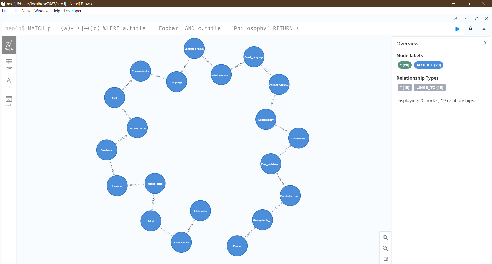
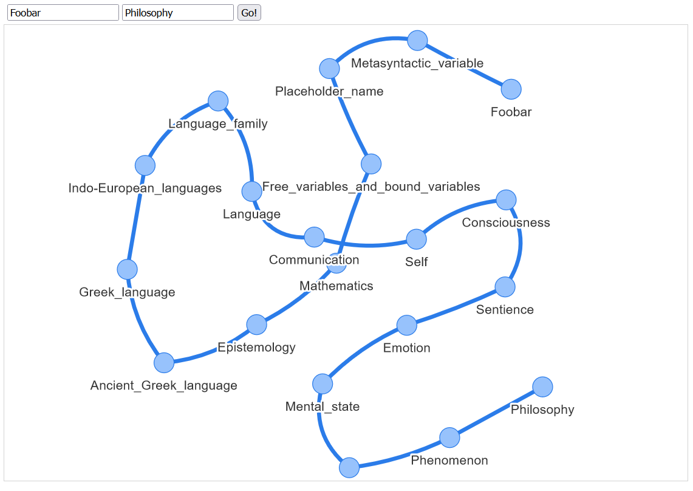

This folder contains the following:

1. A demo of using [web_crawler.py](../web_crawler.py) to find links between articles and store
   them in a [Neo4j](https://neo4j.com/) database.
2. A simple Web page that pulls the stored data and visualize it using [neovis.js](https://github.com/neo4j-contrib/neovis.js/).

[demo.py](demo.py) shows an example like this:

```python
graph = WikipediaLinksGraph("bolt://localhost:7687", "neo4j", "wiki")
graph.add_path("Foobar", "Philosophy")
graph.close()
```

You have to change WikipediaLinksGraph's arguments according to your local Neo4j database credentials.
After running the script, you can run queries on Neo4j Desktop and visualize the data.

For example, a [Cypher](<https://en.wikipedia.org/wiki/Cypher_(query_language)>) query to show all articles linking "Foobar"
to "Philosophy" can be written as follows:

```sql
MATCH p = (a)-[*]->(c)
WHERE a.title = 'Foobar' AND c.title = 'Philosophy'
RETURN *
```



You can also visualize the result by running a local server on this folder (using `python -m http.server` for example)
and navigating to http://localhost:8000/.


